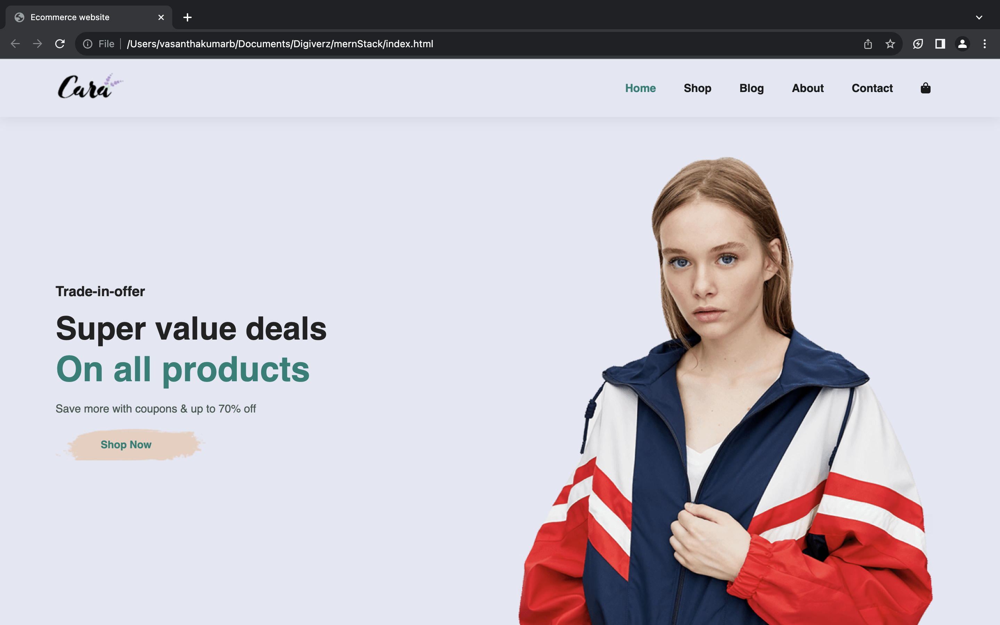

# CaraMart

Welcome to CaraMart, your go-to destination for trendy and eco-friendly shopping! This repository houses the codebase for my first e-commerce website built using a modern tech stack.

## Tech Stack
- **JavaScript**: Powering dynamic and interactive features.
- **Bootstrap**: Ensuring a responsive and visually appealing design.
- **CSS**: Styling to enhance the user experience.
- **HTML**: Structuring the foundation of our web pages.

## Getting Started
1. Clone the repository: `git clone https://github.com/your-username/EcoTrendMarket.git`
2. Open `index.html` in your favorite browser.
3. Explore, shop, and contribute to the eco-friendly revolution!

## Demo

